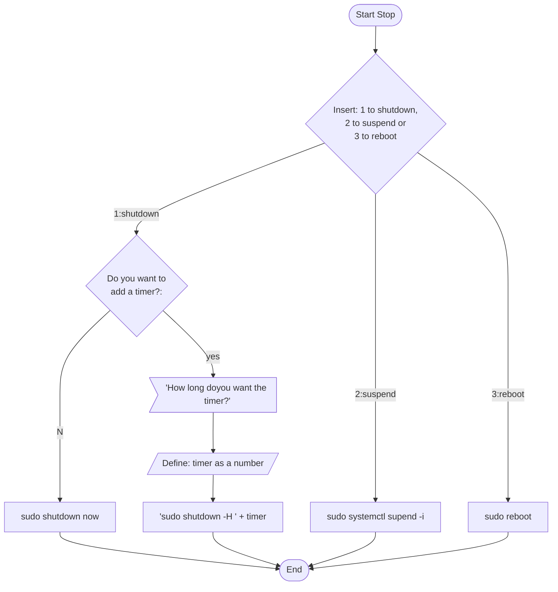

# Stop
## Description
Stop in an application for Linux terminal, to shutdown, reboot or suspend the computer, is developed in c++. But you can make a shutdown timed. To use it, is necessary to have installed the "sudo" command and the gcc compiler, that usually are pre-installed in the system 

## Requirements

- A Linux distribution
- Have installed sudo
- Gcc compiler

## Installation

1. First you have to make the file executable
```shell
chmod +x install.sh
```

2. An then execute script 
```shell
sudo ./install.sh
```
## Working


